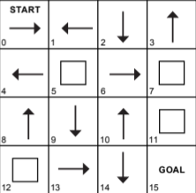

+++
date = '2025-10-20T23:51:02+02:00'
draft = false
title = 'Reinforcement Learning'
+++

# Reinforcement Learning

## Introduction

L’apprentissage par renforcement est un paradigme du machine learning dans lequel on entraîne un agent à prendre des décisions, simples ou complexes, dans un environnement, par un processus d’essais et d’erreurs.
Chaque décision prise par l’agent est ensuite soit récompensée, soit sanctionnée à l’aide d’une fonction de récompense.
L’objectif de l’agent est de maximiser la récompense cumulative au fil du temps. Ce principe s’inspire directement des mécanismes d’apprentissage observés chez les humains et les animaux.

Prenons un exemple simple : un employé dans une entreprise. Tant qu’il fait ce qu’on attend de lui, il reçoit son salaire. S’il ne respecte pas les consignes, il risque d’être sanctionné, voire licencié. Logiquement, pour sécuriser ses revenus, il veille à accomplir correctement ses tâches.

Mais se limiter à cela ne suffit pas pour progresser : en prenant des initiatives et en allant au-delà de ses missions, il peut obtenir des promotions et augmenter significativement ses revenus. Son objectif devient alors clair : maximiser son salaire tout en restant indispensable.

Contrairement à d’autres approches de l’apprentissage automatique, l’agent n’est pas informé de manière explicite des actions à entreprendre. Il doit découvrir par lui-même quelles actions conduisent aux meilleurs résultats à travers l’expérimentation.
L’un des défis centraux de l’apprentissage par renforcement est le compromis entre exploration et exploitation :

* Exploitation : utiliser les connaissances déjà acquises pour maximiser immédiatement la récompense.

* Exploration : tester de nouvelles actions afin de découvrir potentiellement de meilleures stratégies à long terme.

## Maximiser le futur, le but de l'agent

Le retour (ou return), noté $G_t$, est la somme des récompenses futures qu’un agent s’attend à recevoir à partir de l’instant $t$

Dans le cas le plus simple, où l’épisode se termine à un instant $T$, le retour est la somme des récompenses futures :$$G_t = R_{t+1} + R_{t+2} + \dots + R_T$$

Cependant, le futur est incertain : plus on s’éloigne de l’instant $t$, plus la récompense future est soumise à de la variabilité et de l’incertitude. Pour en tenir compte, on introduit un facteur d’actualisation $\gamma$ (ou discount factor), qui permet de réduire progressivement l’importance des récompenses éloignées dans le temps :$$G_t = R_{t+1} + \gamma R_{t+2} + \gamma^2 R_{t+3} + \dots = \sum_{k=0}^{\infty} \gamma^k R_{t+k+1}$$

Rôle du facteur $\gamma$ : 
* Si $\gamma = 0$ seule la récompense immédiate $R_{t+1}$ compte.
* Si $\gamma \approx 1$ : L'agent accorde une grande importance aux récompenses futures, les considérant presque aussi importantes que les récompenses immédiates.

On peut également l’écrire de manière récursive : 
$$G_t = R_{t+1} + \gamma G_{t+1}$$

Cette écriture est particulièrement utile pour comprendre l’équation de Bellman, qui constitue le fondement de nombreuses méthodes d’apprentissage par renforcement.

### Perspectives sur le calcul du retour : approche rétrospective vs prospective

Pour la fonction de retour, il est possible d’adopter deux points de vue, qui mènent à des objectifs et à des techniques différents.

Dans un premier cas, nous adoptons un point de vue rétrospectif : l’agent termine un épisode puis analyse, a posteriori, la contribution réelle de chaque étape à son résultat final. C’est le principe des méthodes Monte-Carlo, qui ne mettent à jour leurs estimations de valeur qu’une fois le retour total observé à la fin de l’épisode.

Le second point de vue est prospectif. Dans ce cas, on se trouve à un temps $t$ donné, l’agent cherche à estimer l’espérance du retour futur à partir de l’état courant $s_t$
grâce à la fonction de valeur
$𝑉(𝑠)$,ou à partir du couple état-action 
$(𝑠,𝑎)$ via $𝑄(𝑠,𝑎)$. Cette perspective est au cœur des méthodes de Différence Temporelle (TD) et de la Programmation Dynamique, qui mettent à jour leurs estimations sans attendre la fin de l’épisode, en anticipant les récompenses futures.

En résumé, nous avons donc deux perspectives : l’une où l’on améliore les actions en utilisant ce qui s’est réellement passé, et l’autre où l’on estime ce qui va se passer dans le but de prendre de meilleures décisions.

## Le cadre mathématique du RL

Les problèmes que l’on cherche à résoudre dans ce paradigme sont appelés Markov Decision Process (MDP).
La propriété clé d’un MDP est que la probabilité de passer d’un état à un autre, suite à une action donnée, ne dépend que de l’état courant et non de l’historique complet des états et actions précédents.
On peut représenter cela par une probabilité de transition. 
$$P(S_{t+1} | S_t, A_t) = P(S_{t+1} | S_t, A_t, S_{t-1}, A_{t-1}, \dots, S_0, A_0)$$

## La politiques: Comment l'agent réussit dans l'insertitude

la fonction d'état valeur est une fonction qqui estime l’espérance du retour à partir d'un état si on suit une politique $\pi$. 
$$v_\pi(s) = \mathbb{E}_\pi [G_t | S_t = s]$$

L'équation de Bellman pour $v_\pi(s)$ est : 
$$v_\pi(s) = \sum_{a} \pi(a|s) \sum_{s', r} p(s', r | s, a) [r + \gamma v_\pi(s')], \forall s \in S$$

la fonction d'action-valeur $q_\pi(s,a)$ c’est l’espérance du retour futur si l’on prend l’action $a$ dans l’état $s$ puis continue à suivre la politique $\pi$ : 
$$q_\pi(s,a) = \mathbb{E}_\pi [G_t | S_t = s, A_t = a]$$

l'équation de Bellman pour $q_\pi(s,a)$ est : 
$$q_\pi(s,a) = \sum_{s', r} p(s', r | s, a) [r + \gamma v_\pi(s')], \forall s \in \mathcal{S}, \forall a \in \mathcal{A}(s)$$

Un algorithme d’apprentissage par renforcement (Reinforcement Learning) est défini par :

* L’agent : le modèle qui interagit avec l’environnement.

* Les actions : les différentes interactions possibles que l’agent peut effectuer dans l’environnement.

* L’environnement : le cadre dans lequel l’agent évolue et sur lequel ses actions ont un effet.

* La récompense : le signal numérique attribué à l’agent pour évaluer la qualité de son action ; elle peut être positive (récompense) ou négative (punition).

* La politique (policy) : le « raisonnement » ou la stratégie de l’agent, qui détermine quelle action choisir pour un état donné de l’environnement.

* La valeur (value) : une estimation de la récompense cumulée que l’agent peut espérer obtenir à long terme à partir d’un certain état.
